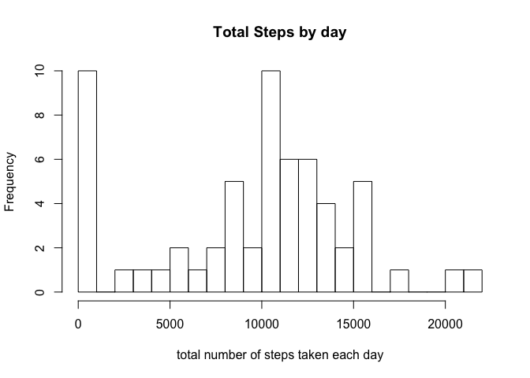
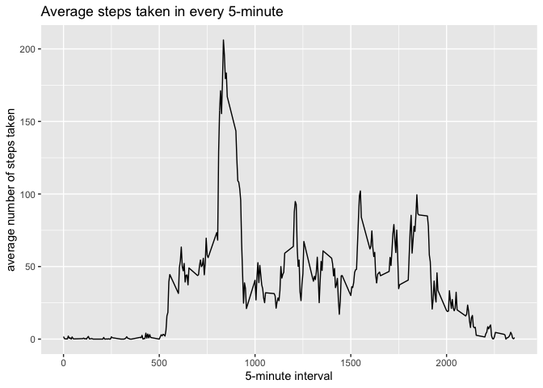
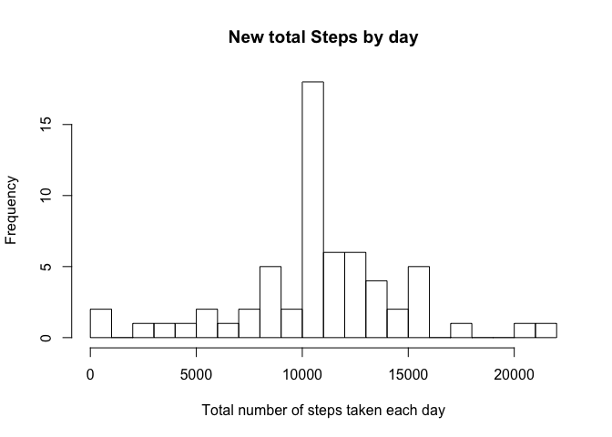
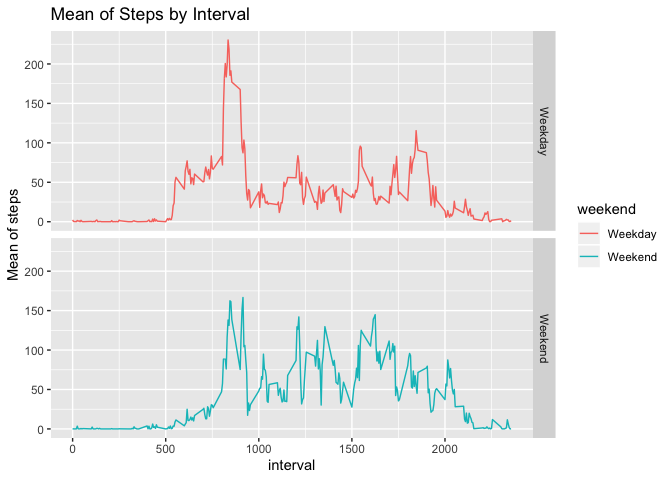

## Loading and preprocessing the data

```r
setwd<-"/Users/yusue/Documents/GitHub/RepData_PeerAssessment1"
unzip("activity.zip")
rawdata<-read.csv("activity.csv")
rawdata$steps <- as.numeric(rawdata$steps)
rawdata$interval <- as.numeric(rawdata$interval)
rawdata$date<-as.Date(rawdata$date,"%Y-%m-%d")
```

## What is mean total number of steps taken per day?

```r
library(ggplot2)
library(dplyr)
```

```
## 
## Attaching package: 'dplyr'
```

```
## The following objects are masked from 'package:stats':
## 
##     filter, lag
```

```
## The following objects are masked from 'package:base':
## 
##     intersect, setdiff, setequal, union
```

```r
total<-summarise(group_by(rawdata,date),tsteps=sum(steps,na.rm = T))
```
##### 1. Histogram of the total number of steps taken each day

```r
hist(total$tsteps,binwidth=500, xlab="total number of steps taken each day", main="Total Steps by day",breaks = 20)
```

```
## Warning in plot.window(xlim, ylim, "", ...): "binwidth" is not a graphical
## parameter
```

```
## Warning in title(main = main, sub = sub, xlab = xlab, ylab = ylab, ...):
## "binwidth" is not a graphical parameter
```

```
## Warning in axis(1, ...): "binwidth" is not a graphical parameter
```

```
## Warning in axis(2, ...): "binwidth" is not a graphical parameter
```

<!-- -->


##### 2. Mean and median total number of steps taken per day

```r
mean.steps<-mean(total$tsteps)
median.step<-median(total$tsteps)
```
* Mean: 9354.2295082 
* Median: 1.0395\times 10^{4}

## What is the average daily activity pattern?

```r
library(dplyr)
interval_data <- rawdata %>% select(interval,steps) %>% na.omit %>% group_by(interval) %>% summarise(tsteps=mean(steps))
```
##### 1. Time series plot

```r
ggplot(interval_data,aes(interval,tsteps),type="l")+geom_line()+xlab("5-minute interval") +
    ylab("average number of steps taken")+ggtitle("Average steps taken in every 5-minute")
```

<!-- -->


##### 2. The 5-minute interval on average across all the days in the dataset that contains the maximum number of steps?

```r
max<-interval_data[which.max(interval_data$tsteps),]
```
* Most Steps at: 835, 206.1698113 

## Imputing missing values


##### 1. The total number of missing values in the dataset 

```r
missing<- is.na(rawdata$steps)
numMissingvalues <- length(which(missing))
```
* Number of missing values: 2304


##### 2. Devise a strategy for filling in all of the missing values in the dataset.


##### 3. Create a new dataset that is equal to the original dataset but with the missing data filled in.

```r
missingdata<-rawdata[missing, ]
mergedata<-merge(missingdata, interval_data,by="interval")
mergedata <- select(mergedata,-(steps))
colnames(mergedata)<- c("interval","date","steps")

leftdata<-rawdata[!missing, ]
newdataset<- rbind(mergedata,leftdata)
newdataset<- arrange(newdataset,date)
```
##### 4. Histogram of the total number of steps taken each day 

```r
new.total.steps<-newdataset %>% group_by(date) %>% summarise(total.steps=sum(steps))

hist(new.total.steps$total.steps, xlab = "Total number of steps taken each day", main="New total Steps by day",breaks = 20)
```

<!-- -->


##### Calculate and report the mean and median total number of steps taken per day. 

```r
newmean<-mean(new.total.steps$total.steps)
newmedian <-median(new.total.steps$total.steps)
```
* Mean: 1.0766189\times 10^{4}
* Median:  1.0766189\times 10^{4}

## Are there differences in activity patterns between weekdays and weekends?


#### 1.Create a new factor variable in the dataset with two levels ??? ???weekday??? and ???weekend??? indicating whether a given date is a weekday or weekend day.

```r
newdataset$weekday <- weekdays(newdataset$date)
newdataset$weekend<- ifelse(newdataset$weekday=="Saturday" | newdataset$weekday=="Sunday", "Weekend", "Weekday")
weekday_vs_weekend<-newdataset %>% select(interval,steps,weekend) %>% na.omit %>% group_by(weekend, interval) %>% summarise(steps=mean(steps))
```
##### 2. Panel plot containing a time series plot

```r
ggplot(weekday_vs_weekend,aes(interval,steps,color=weekend))+geom_line()+facet_grid(weekend ~ .)+ labs(title = "Mean of Steps by Interval", x = "interval", y = "Mean of steps")
```

<!-- -->
